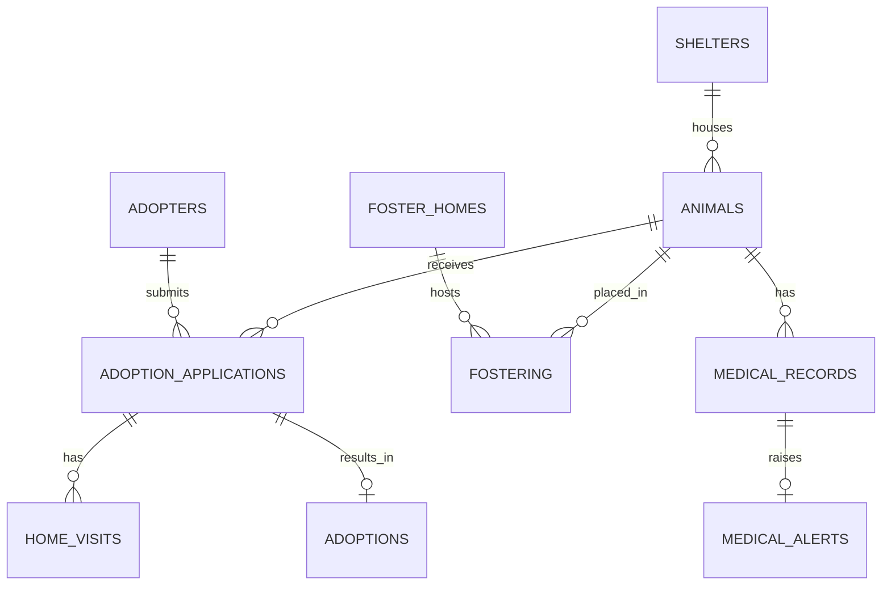

# Pet Adoption & Fostering Network — Design (CSE3001)

## 1. Problem
Shelters need one place to register animals, match them to adopters, track applications and home visits, manage foster placements, follow medical care, and complete adoptions safely.

## 2. Entities
| Table | Purpose | Key |
|---|---|---|
| shelters | Shelter locations | shelter_id |
| animals | Animal records, status | animal_id, FK shelter_id (optional) |
| adopters | People adopting, with preferences | adopter_id, UNIQUE email |
| foster_homes | Foster homes with max_capacity | foster_home_id |
| fostering | Animal ↔ foster home placements | fostering_id |
| adoption_applications | Adopter ↔ animal application | application_id |
| home_visits | Visit outcome per application | visit_id |
| adoptions | Completed adoption (1 per application) | adoption_id, UNIQUE application_id |
| medical_records | Exams and follow-ups | record_id |
| medical_alerts | Overdue follow-up alerts (1 per record) | alert_id, UNIQUE record_id |

## 3. ER diagram


## 4. Business rules
- Animal status: Available, Fostered, Adopted, Unavailable. Shelter link is optional.
- Application status: Pending, Under Review, Approved, Rejected, Withdrawn.
- Foster placements cannot exceed the home's `max_capacity` (trigger).
- A completed adoption sets the animal to Adopted (trigger).
- Completing a foster placement returns the animal to Available (trigger).
- `Approve_Adoption` needs: Approved application + latest home visit Completed and Recommended + animal not already adopted; runs in a transaction with row locks and rolls back on failure.
- Triggers fire on row changes only; run `Generate_Overdue_Medical_Alerts()` for records that became overdue later.

## 5. Normalization
All tables are in 3NF: each non-key attribute depends on the key only. Repeating data (shelter, adopter, foster home) lives in its own table and is referenced by FK. Lookup values use ENUMs plus CHECK constraints.

## 6. Objects
- **Views:** Available_Animals_View, Medical_Followup_View, Adoption_Application_Summary_View
- **Indexes:** animals(status), animals(species,size), applications(status), medical_records(next_checkup_date), fostering(foster_home_id,status)
- **Triggers:** medical alert, adoption → Adopted, foster capacity (insert/update), foster status sync
- **Procedures:** Approve_Adoption, Animal_Availability_Report, Match_Animals_For_Adopter, Generate_Overdue_Medical_Alerts

## 7. How to run
```sql
SOURCE Schema.sql;
SOURCE Views_Indexes_Triggers_Procedures.sql;
SOURCE Data.sql;
```
Then try:
```sql
SELECT * FROM Available_Animals_View;
SELECT * FROM Medical_Followup_View;
CALL Approve_Adoption(3);
CALL Generate_Overdue_Medical_Alerts();
```

## 8. Dataset
`pet_adoption_dataset.csv` holds the animal intake data (10 rows) matching the `animals` table, with shelter names.
